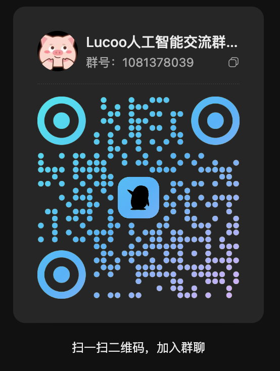

# Codex 无需验证码 / 免短信登录 · Agent Identity 纯前端工具

**Codex 无需验证码 · Codex 免短信 · 跳过手机验证 · 免接码登录 Codex CLI / Cockpit**

在浏览器里把已登录的 ChatGPT **Session / accessToken** 转成 Codex 可用的 **`auth.json`（agent_identity）**，再导入 **Cockpit** 一键启动 Codex。  
适合已经有 ChatGPT 登录态、但不想再走 Codex **OAuth 手机验证码 / 短信验证** 的场景。

> 说明：免的是 **Codex 客户端 OAuth 接码**，不是「白号免短信注册 ChatGPT」。前提是账号本身已有有效 Session。

- **Codex 无需验证码 / 免短信**：用现有 ChatGPT 会话生成 Agent Identity，避免再走官方登录接码
- **纯前端 · 无后端**：密钥用 Web Crypto 本地生成，Session 不经过第三方服务器
- **只请求 OpenAI**：仅 `auth.openai.com` 注册 agent
- **一键导入 Cockpit**：下载 `auth.json` → 本地文件导入 → 启动 Codex
- **静态托管**：GitHub Pages / CDN，可自建

关键词（便于搜索）：`Codex 无需验证码` `Codex 免短信` `Codex 跳过手机验证` `Codex 免接码` `ChatGPT Codex 登录` `agent_identity` `auth.json` `Cockpit 导入 Codex` `Session 转 auth.json` `Codex CLI 登录`

> 逻辑对齐社区脚本「久雾 · codex_agent.py」：Session → Ed25519 → `agent/register` → `auth.json`。

## 在线使用

- **正式域名**：https://codex.lucoo.net/
- **GitHub Pages 备用**：https://jeremypy.github.io/codex-agent-identity/
- **仓库**：https://github.com/JeremyPy/codex-agent-identity

本地预览：

```bash
cd codex-agent-identity
python3 -m http.server 8787
# 打开 http://127.0.0.1:8787
```

## 使用步骤（与网页一致）

1. **登录** — 浏览器打开 [chatgpt.com](https://chatgpt.com) 并登录  
2. **复制 Session** — 打开 `https://chatgpt.com/api/auth/session`，复制整页 JSON  
3. **生成** — 粘贴到网页输入框（自动格式化）→ 点「生成 auth.json」→ 下载  
4. **Cockpit 导入**  
   1. [下载 Cockpit](https://github.com/jlcodes99/cockpit-tools/releases)  
   2. 添加 Codex 账号 → **导入**  
   3. **从本地文件导入** 刚下载的 `auth.json`  
   4. 确认后 **不检测，直接导入** → **刷新**  
   5. 点 **开始** 进入 Codex  

## 输入格式

| 格式 | 示例 |
|------|------|
| 纯 JWT | `eyJhbGciOi...` |
| session JSON | `/api/auth/session` 完整响应 |
| 含 `accessToken` 的对象 | `{"accessToken":"eyJ..."}` |
| 杂乱粘贴 | 前后混有 UI 文案时，**粘贴后自动清理并格式化** |

## 输出格式

```json
{
  "auth_mode": "agent_identity",
  "agent_identity": {
    "agent_runtime_id": "agent-...",
    "agent_private_key": "MC4CAQAw...",
    "account_id": "...",
    "chatgpt_user_id": "user-...",
    "email": "...",
    "plan_type": "pro",
    "chatgpt_account_is_fedramp": false
  }
}
```

也可用于支持 **Agent Identity** 导入的 Sub2API 等网关。

## 原理（简述）

```
有效 accessToken (JWT)
  → 解码 claims 得到 account / user / plan
  → 浏览器生成 Ed25519 密钥对
  → POST https://auth.openai.com/api/accounts/v1/agent/register
  → 得到 agent_runtime_id
  → 写出 auth.json
  → Cockpit 从本地文件导入 → 启动 Codex
```

「无需接码」指的是：**不必再走 Codex 官方 OAuth 登录流程**。  
**不是**「注册 ChatGPT 白号免短信」。前提是账号已有有效 Session。

## 浏览器要求

- 支持 **Ed25519** 的 Web Crypto（较新的 Chrome / Edge / Firefox / Safari）
- **Secure Context**：`https://` 或 `http://localhost`

## 安全与合规

- `accessToken` 等同密码，页面不会把它发到除 OpenAI 以外的域名
- 生成结果含 **私钥**，请本地保管，勿提交到公开仓库
- 请仅用于你有权使用的账号，并遵守 [OpenAI 服务条款](https://openai.com/policies)
- 接口与策略可能随时变更，本项目不保证长期可用

## 部署到 GitHub Pages

本仓库已启用 Pages（`main` 分支根目录）。自托管：

1. Fork / 推送本仓库  
2. Settings → Pages → Deploy from branch → `main` / `/`  
3. 访问 `https://<user>.github.io/codex-agent-identity/`

也可丢到 Cloudflare Pages / Vercel / 任意静态 CDN。

## 目录

```
codex-agent-identity/
├── index.html
├── styles.css
├── app.js
├── assets/          # Cockpit 操作截图
├── LICENSE
└── README.md
```

## License

MIT

---

更多教程见 [lucoo.net](https://lucoo.net/)。交流 QQ 群：`1081378039`。


